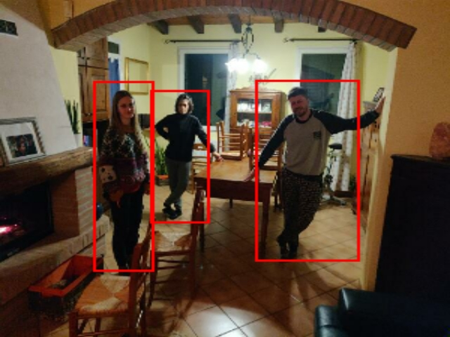

# Social Distancing Android
Android application to monitor social distancing. Project for the class Sistemi Digitali M, UNIBO.

## Usage
The application lets the user take a photo, and it analyzes the position of the people in the scene, reporting risk cases. 

<p align="center">
  
</p>

If the minimum distance if under 1m, it will be reported in red, between 1m and 2m in yellow, over 2m in green. The numbers inside the square represent the distance between the device and the person. The numbers over the lines represent the distance in meters between two people. 

To infer the distance of the people from the camera we used [PyDNet](https://github.com/FilippoAleotti/mobilePydnet/tree/v2), a convolutional neural network for depth estimation from a single image, scaled in meters using the feature points found by ARCore.

<p align="center">
  
  
</p>

To recognize the people in the scene we used [EfficientDet](https://tfhub.dev/tensorflow/lite-model/efficientdet/lite4/detection/metadata/1), a neural network for object detection by TensorFlow.

<p align="center">
  
</p>

Here is a video showing the complete functioning of the application.

<p align="center">
  
</p>

## Setup

Clone the project and use Android Studio to generate an APK or to install directly on the smartphone. The necessary prerequisites are:
<ul>
  <li>ARCore supported smartphone
  <li>Android 10.0 (SDK 29)
</ul>

## Additional Code

We included a python program ([3dSceneRecostruction](3dSceneRecostruction.py)) to create a 3D recostruction of the images saved by the app. Open3D version 0.12.0 is required.
Execute the program in the same directory where you have saved the image, the depth map and the json file:

```shell
python3 3dSceneRecostruction.py sda-20210409-181002.json
```

You can found these files in the app-specific files using Android Studio.

<p align="center">
  
</p>
